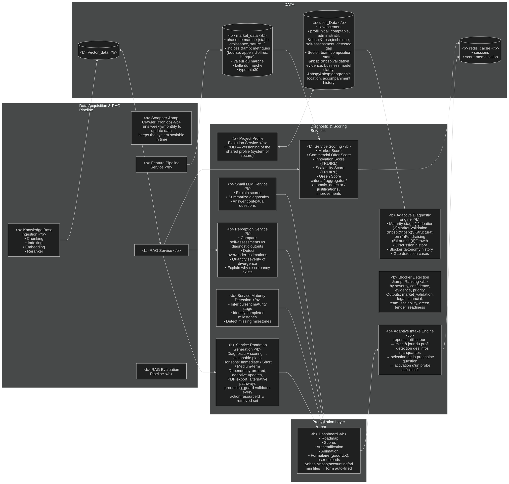
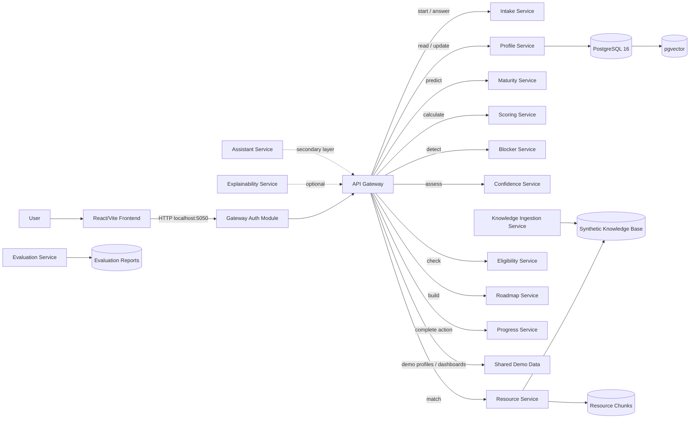
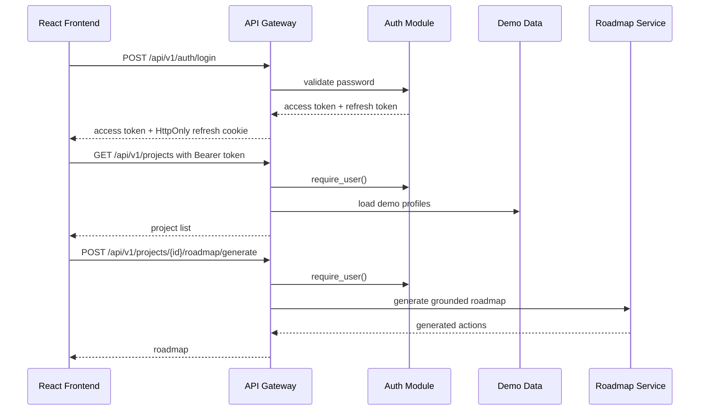
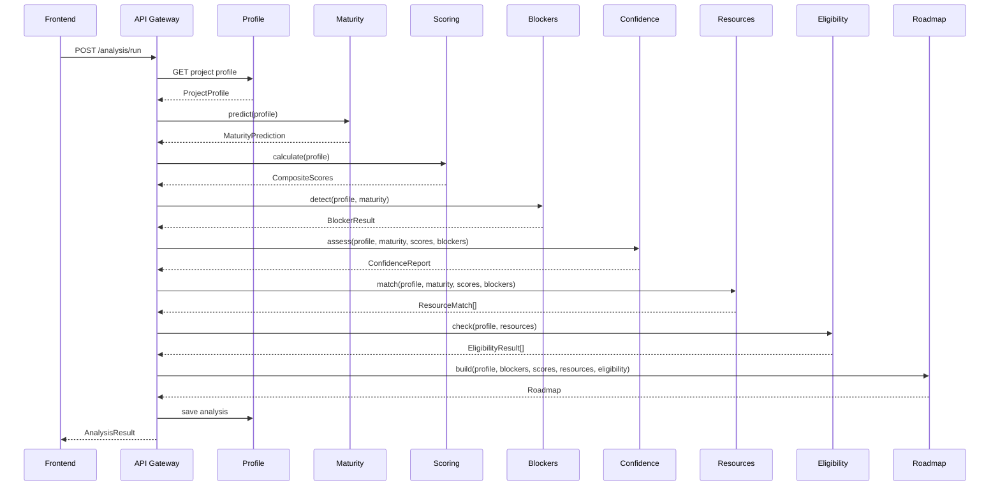
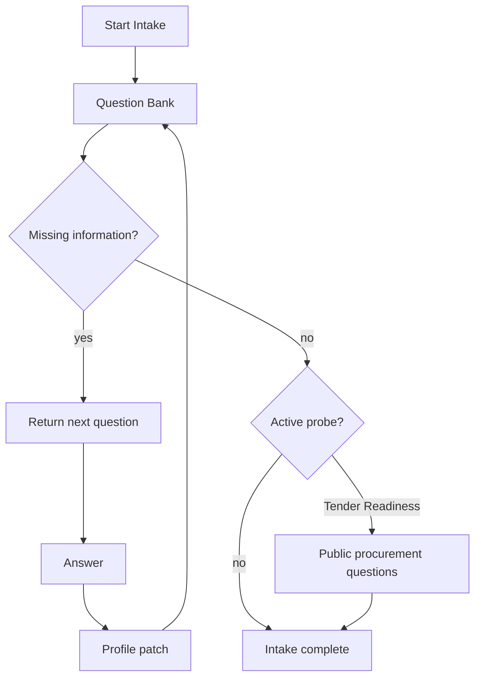
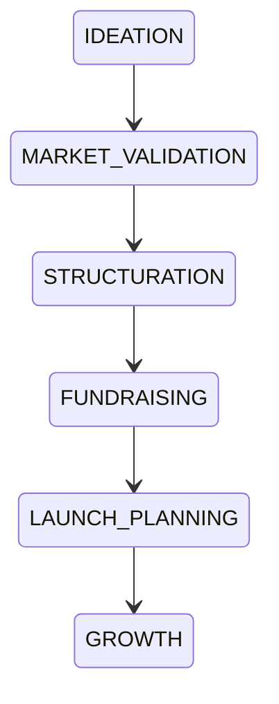
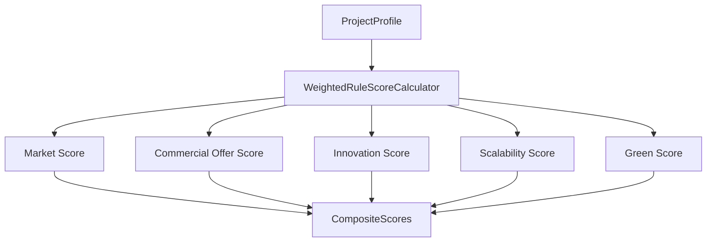
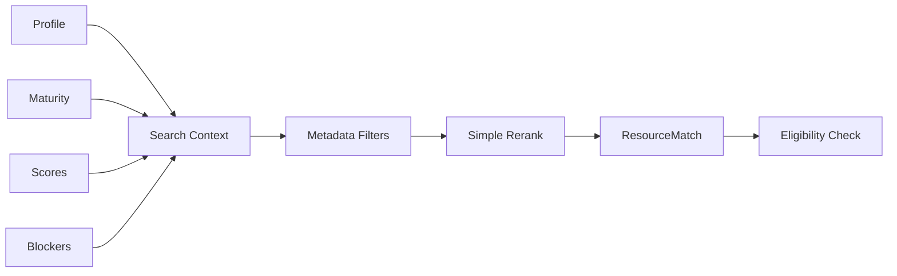

# Massar Detailed Architecture

This document describes the architecture of the Massar MVP.

The system is designed for a hackathon context, but it is structured so it can evolve toward a more robust architecture: SQLAlchemy persistence, a broker, a model registry, asynchronous orchestration, and Kubernetes deployment.

## Overview

The project is a service-oriented monorepo.

Each service exposes:

- a `/health` endpoint;
- a `/ready` endpoint;
- a dedicated FastAPI application;
- a `Dockerfile`;
- a clear business responsibility;
- shared schemas through `shared/contracts`.

The gateway is the public entry point. It owns the minimal MVP authentication layer, protects the public routes, and orchestrates internal services through HTTP communication in Docker Compose.

Architecture image:



Global diagram:



## Public API And Authentication

The MVP authentication layer lives inside:

```text
services/api_gateway/app/auth/
services/api_gateway/app/api/auth.py
services/api_gateway/data/demo_users.json
```

It is intentionally minimal and compatible with the existing service layout. No generic `backend/` folder and no standalone `auth_service` were introduced.

Authentication responsibilities:

- register and log in local demo users;
- issue HMAC-signed access and refresh tokens;
- store the refresh token in an HttpOnly cookie;
- protect project, dashboard, roadmap, resources, progress, and assistant routes;
- support password reset endpoints for demo use;
- support TOTP 2FA setup, confirmation, login verification, and disablement.

Protected route dependency:

```text
services/api_gateway/app/dependencies.py -> require_user()
```

The frontend keeps only the access token in memory. The refresh token is managed by the browser cookie through the gateway.



## Analysis Pipeline

The main public endpoint is:

```text
POST /api/v1/projects/{project_id}/analysis/run
```

## MVP Frontend Flow

The frontend is a React/Vite application in:

```text
frontend/
```

The current protected navigation is:

```text
/login
/register
/verify-2fa
/dashboard
/projects/new
/projects/{project_id}/intake
/projects/{project_id}/dashboard
/projects/{project_id}/roadmap
/projects/{project_id}/resources
/projects/{project_id}/journey
/settings/security
```

The demonstrable MVP path is:


All project dashboard, blockers, resources, roadmap, and progress content is requested through the API. The React pages do not hardcode the provisional JSON payloads.

It orchestrates the following sequence:



## Adaptive Intake Flow

The intake is not a static form. The service selects the next questions based on the profile and missing information.



The first specialized probe is `TenderReadinessProbe`.

Activation:

```text
primary_goal == public_procurement
or
wants_public_tenders == true
```

Possible outputs:

- `NOT_READY`
- `READY_FOR_SMALL_TENDERS`
- `READY_WITH_PARTNER`
- `READY`

## Service Boundaries

| Service | Port | Responsibility | Main inputs | Main outputs |
| --- | --- | --- | --- | --- |
| `api_gateway` | `5050` | Public API, auth, route protection, and orchestration | Frontend requests | `AnalysisResult`, dashboard, auth responses |
| `intake_service` | `5051` | Adaptive questionnaire | `ProjectProfile`, session | `IntakeSession`, profile patch |
| `profile_service` | `5052` | Profile, dashboard, MVP storage | `ProjectCreateRequest`, patch | `ProjectProfile`, `DashboardResponse` |
| `maturity_service` | `5053` | Maturity and gap detection | `ProjectProfile` | `MaturityPrediction` |
| `scoring_service` | `5054` | Scores | `ProjectProfile` | `CompositeScores` |
| `blocker_service` | `5055` | Blockers | `ProjectProfile`, maturity | `BlockerResult` |
| `confidence_service` | `5056` | Uncertainty | profile, maturity, scores, blockers | `ConfidenceReport` |
| `resource_service` | `5057` | Resource matching | profile, scores, blockers | `ResourceMatch[]` |
| `eligibility_service` | `5058` | Eligibility | profile, resources | `EligibilityResult[]` |
| `roadmap_service` | `5059` | Roadmap generation and action status updates | blockers, scores, resources, demo analysis | `Roadmap`, `GeneratedRoadmap` |
| `progress_service` | `5060` | Journey tracking | completed action | `ProgressEvent` |
| `explainability_service` | `5061` | Explanations | structured context | text |
| `knowledge_ingestion_service` | `5062` | Knowledge base ingestion | resource files | chunks + embeddings |
| `evaluation_service` | `5063` | Evaluation | synthetic dataset | JSON report |
| `assistant_service` | `5064` | Secondary assistant | message + context | answer |

## Shared Contracts

Pydantic contracts live in:

```text
shared/contracts/
```

## Demo Data Layer

Temporary MVP data is isolated from frontend components and loaded through Python providers.

```text
shared/demo_data/demo_profiles.json
shared/demo_data/demo_analysis.json
shared/demo_data/demo_resources.json
shared/demo_data/provider.py
```

The API Gateway exposes this data through protected endpoints:

```text
GET /api/v1/projects
GET /api/v1/projects/{project_id}
GET /api/v1/projects/{project_id}/dashboard
GET /api/v1/projects/{project_id}/resources
```

Roadmap templates live in:

```text
services/roadmap_service/data/roadmap_templates.json
```

The generated roadmap enforces MVP rules:

- at most eight actions;
- priority based on blocker severity and template weight;
- no future-stage actions before the diagnosed stage is ready;
- resource IDs must come from the available resource list;
- missing information becomes explicit follow-up actions.

Main objects:

- `ProjectProfile`
- `Question`
- `IntakeSession`
- `MaturityPrediction`
- `CompositeScores`
- `BlockerResult`
- `ConfidenceReport`
- `ResourceMatch`
- `EligibilityResult`
- `Roadmap`
- `AnalysisResult`
- `DashboardResponse`

Business enums live in:

```text
shared/contracts/enums.py
```

## Domain Layer

Business logic is centralized in:

```text
shared/domain/
```

Main modules:

- `intake.py`: adaptive question selection;
- `maturity.py`: rule-based classification;
- `scoring.py`: five-score calculation;
- `blockers.py`: multi-blocker detection;
- `confidence.py`: uncertainty and missing fields;
- `resources.py`: resource matching;
- `eligibility.py`: eligibility checks;
- `roadmap.py`: action plan generation;
- `probes.py`: Tender Readiness Probe.

FastAPI routes are intentionally thin. They delegate to domain modules.

## Maturity Taxonomy



Stages:

- `IDEATION`
- `MARKET_VALIDATION`
- `STRUCTURATION`
- `FUNDRAISING`
- `LAUNCH_PLANNING`
- `GROWTH`

The perception gap compares:

```text
declared_stage vs diagnosed_stage
```

Levels:

- `NONE`
- `LOW`
- `MEDIUM`
- `HIGH`

## Scoring

Scoring is explainable and does not depend on an LLM.

Mandatory scores:

- `market_score`
- `commercial_offer_score`
- `innovation_score`
- `scalability_score`
- `green_score`

Each score contains:

- value out of 100;
- sub-scores;
- weights;
- contributions;
- missing criteria;
- anomalies;
- priority improvement action;
- rule version.



## RAG And Resources

The MVP uses a synthetic knowledge base:

```text
data/knowledge_base/resources.json
```

Each resource is marked as:

```json
{
  "synthetic": true
}
```

Matching applies:

- country;
- diagnosed stage;
- journey type;
- primary need;
- blockers;
- weak scores;
- eligibility conditions;
- chunk IDs and source URL.



## Database

The project includes PostgreSQL 16 + pgvector through Docker Compose.

Initial migration:

```text
shared/database/migrations/versions/0001_initial.py
```

Planned tables:

- `users`
- `projects`
- `project_profile_versions`
- `intake_sessions`
- `questions`
- `answers`
- `diagnoses`
- `maturity_predictions`
- `score_runs`
- `score_components`
- `blockers`
- `resources`
- `resource_chunks`
- `eligibility_results`
- `roadmaps`
- `roadmap_actions`
- `progress_events`
- `audit_events`
- `model_versions`
- `rule_versions`
- `evaluation_runs`

`resource_chunks.embedding` uses `vector(32)`.

## Country Configuration

Files:

```text
rules/countries/tn.yaml
rules/countries/ma.yaml
rules/countries/dz.yaml
```

They contain:

- country code;
- currency;
- legal forms;
- institutions;
- public procurement platform;
- local terminology;
- supported languages;
- specific rules.

## Rules And Model Versioning

Rules:

```text
rules/
```

Registry:

```text
models/registry.json
```

Configurable providers:

```text
MATURITY_MODEL_PROVIDER=rules
BLOCKER_MODEL_PROVIDER=rules
SCORING_MODEL_PROVIDER=weighted_rules
LLM_PROVIDER=mock
```

Interfaces:

```text
shared/model_interfaces/base.py
```

## LLM

The LLM is not responsible for decisions.

It can only:

- rephrase;
- summarize;
- explain;
- adapt language.

Providers:

- `MockLLMProvider`: works without an API key;
- `OpenAICompatibleProvider`: configurable through environment variables.

## Observability

Each service exposes:

```text
GET /health
GET /ready
```

The shared middleware adds:

- correlation ID;
- latency measurement;
- structured logs if `structlog` is available;
- standard-library fallback if `structlog` is not installed locally.

## Execution Modes

### Docker HTTP Mode

Used by `docker compose up -d --build`.

The gateway calls internal services through HTTP:

```text
ORCHESTRATION_MODE=http
```

Public ports:

```text
frontend: http://localhost:5000
api_gateway: http://localhost:5050
roadmap_service: http://localhost:5059
```

After the stack starts, the user signs in at `http://localhost:5000` with the demo account and follows Dashboard -> Blockers -> Roadmap -> My Journey.

### Local Test/Demo Mode

Tests and scripts use the in-memory pipeline:

```text
shared/application/orientation_pipeline.py
```

This keeps tests fast and deterministic.

## Validation Commands

```powershell
docker compose config --quiet
python -m pytest -q
python scripts/seed_database.py
python scripts/run_demo.py
python scripts/ingest_knowledge_base.py
```

## Extension Points

The architecture prepares the following evolutions:

- complete SQLAlchemy repositories;
- event bus or broker;
- asynchronous orchestration;
- model registry;
- real scikit-learn training;
- complete pgvector retrieval;
- production identity provider or persisted auth tables;
- advanced observability;
- Kubernetes deployment.
