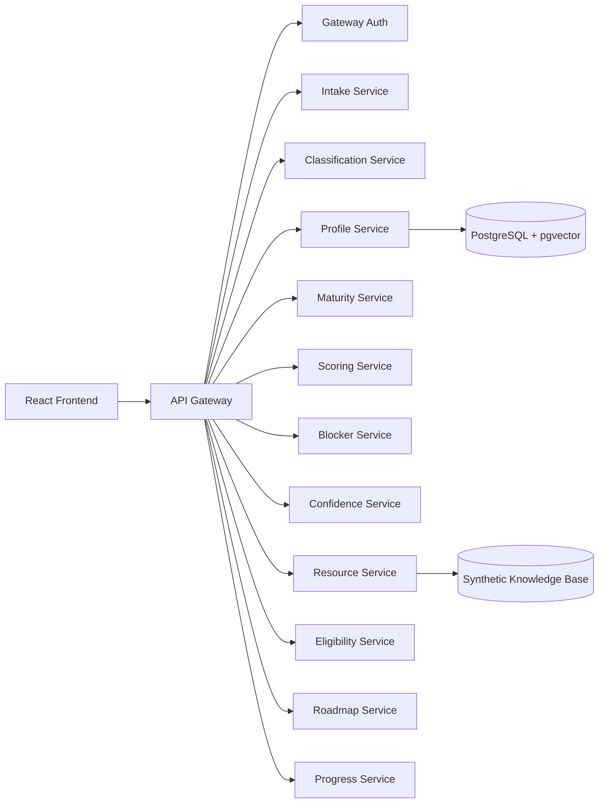

# Massar

Massar is a hackathon MVP for guiding entrepreneurs, startup founders and project owners in Tunisia, Morocco and Algeria.

Massar is not a chatbot. Its core is a structured orientation engine that turns a project profile into an explainable diagnosis, maturity gap, multidimensional scores, prioritized blockers, eligible resources, a grounded roadmap and journey tracking.

**Demo video:** [Google Drive demo](https://drive.google.com/file/d/12uBGaiK5QQhAiKl491SJwL8qFy6Vz2oq/view)

**Preserved Git history:** see [HISTORY.md](./HISTORY.md). This file keeps the original commit timeline in plain text in case the repository is republished without its `.git` directory.

**Detailed Mermaid architecture:** see [docs/architecture-mermaid.md](./docs/architecture-mermaid.md).

## What It Does

Massar helps a founder answer one practical question:

```text
Where is my project really, what blocks the next stage, and what should I do next?
```

The MVP supports:

- adaptive project intake in French/Arabic-friendly flows;
- perceived maturity collection through the classification/PML service;
- evidence-ledger intake with missing information and contradiction handling;
- maturity diagnosis across six stages;
- declared-vs-diagnosed gap detection;
- five explainable scores;
- prioritized blocker detection;
- confidence and missing-field reporting;
- synthetic resource matching with separate eligibility checks;
- generated roadmap actions grounded in blockers, weak scores and resources;
- progress tracking in "My Journey";
- demo authentication with optional TOTP-based 2FA.

## Demo Account

After starting the stack, open the frontend and sign in with:

```text
Email: demo@massar.local
Password: MassarDemo123!
```

Recommended demo path:

```text
Login
-> Dashboard
-> Demo project
-> Diagnostic / blockers
-> Generate roadmap
-> Mark action complete
-> My Journey
```

Covered demo case:

```text
Declared stage: FUNDRAISING
Actual signals: no paying customers, weak market validation
Expected diagnosed stage: MARKET_VALIDATION
Expected gap: HIGH
```

## Architecture

The project is a service-oriented monorepo. FastAPI services live in `services/`, shared contracts and domain engines live in `shared/`, the React frontend lives in `frontend/`, and versioned rules live in `rules/`.



Useful architecture documents:

- [ARCHITECTURE.md](./ARCHITECTURE.md)
- [docs/architecture.md](./docs/architecture.md)
- [docs/architecture-mermaid.md](./docs/architecture-mermaid.md)
- [docs/api-contracts.md](./docs/api-contracts.md)
- [docs/data-model.md](./docs/data-model.md)
- [docs/domain-model.md](./docs/domain-model.md)
- [docs/ml-strategy.md](./docs/ml-strategy.md)
- [docs/rag-strategy.md](./docs/rag-strategy.md)

Provided architecture image:


## Main Pipeline

The classic analysis pipeline is:

```text
create project
-> start intake
-> answer questions
-> run analysis
-> diagnose maturity
-> detect perception gap
-> calculate five scores
-> detect blockers
-> match resources
-> check eligibility
-> build roadmap
-> display dashboard
-> complete roadmap action
```

The API Gateway orchestrates the pipeline through internal HTTP calls when `ORCHESTRATION_MODE=http`. Tests and scripts can use the local `InMemoryOrientationPipeline` for deterministic execution.

## Services

| Service | Port | Responsibility |
| --- | ---: | --- |
| Frontend | 5000 | React/Vite interface |
| API Gateway | 5050 | Public API, auth, protected routes, orchestration |
| Intake Service | 5051 | Legacy intake and adaptive evidence-ledger intake |
| Profile Service | 5052 | Project profiles, dashboards, MVP storage |
| Maturity Service | 5053 | Rule-based and model-wrapper maturity prediction |
| Scoring Service | 5054 | Five explainable scores |
| Blocker Service | 5055 | Prioritized blockers |
| Confidence Service | 5056 | Confidence, ambiguity, missing fields |
| Resource Service | 5057 | Synthetic resource matching |
| Eligibility Service | 5058 | Eligibility checks separate from relevance |
| Roadmap Service | 5059 | Grounded roadmap generation and action status |
| Progress Service | 5060 | Journey/progress events |
| Classification Service | 5061 | PML perceived maturity questionnaire |
| Knowledge Ingestion Service | 5062 | Resource chunking and embeddings |
| Evaluation Service | 5063 | Evaluation metrics and reports |
| Assistant Service | 5064 | Secondary assistant layer |
| Explainability Service | 5065 | Structured-output explanations |
| PostgreSQL | 5432 | Relational database + pgvector |
| Redis | 6379 | Optional intake session store |

Swagger is available at:

```text
http://localhost:5050/docs
```

## Quick Start

Prerequisites:

- Docker Desktop;
- Docker Compose;
- Python 3.12 for local tests and scripts;
- Node.js if running the frontend outside Docker.

From the project root:

```powershell
cd "C:\Users\medte\OneDrive\Desktop\AINS 4.0 code\entrepreneur-orientation-engine"
```

Copy the example environment if needed:

```powershell
Copy-Item .env.example .env
```

Start the full stack:

```powershell
docker compose up -d --build
```

Check status:

```powershell
docker compose ps
```

Open:

```text
Frontend: http://localhost:5000
Gateway Swagger: http://localhost:5050/docs
```

Stop the stack:

```powershell
docker compose down
```

Reset local volumes:

```powershell
docker compose down -v
docker compose up -d --build
```

## Useful Commands

Run tests:

```powershell
python -m pytest -q
```

Run the frontend build:

```powershell
npm run build
```

Run evaluation artifacts:

```powershell
python scripts\run_evaluation.py
python scripts\run_performance_benchmark.py
python scripts\generate_evaluation_report_data.py
```

Classification service tests:

```bash
export PYTHONPATH=.
export USE_DEMO_CLASSIFIER=1
python -m pytest services/classification_service/tests -q
```

Docker logs:

```powershell
docker compose logs -f api_gateway
docker compose logs -f frontend
```

## Authentication

The MVP authentication layer lives in:

```text
services/api_gateway/app/auth/
services/api_gateway/app/api/auth.py
```

It provides:

- local demo user registration and login;
- HMAC-signed access and refresh tokens;
- HttpOnly refresh-token cookie;
- bearer access token for protected calls;
- optional TOTP 2FA setup, confirmation, verification and disablement;
- password reset endpoints for demo use.

Auth endpoints:

| Endpoint | Purpose |
| --- | --- |
| `POST /api/v1/auth/register` | Create a local demo user |
| `POST /api/v1/auth/login` | Return an access token and set a refresh cookie |
| `POST /api/v1/auth/refresh` | Refresh the access token using the cookie |
| `GET /api/v1/auth/me` | Return the current authenticated user |
| `POST /api/v1/auth/logout` | Clear the refresh cookie |
| `POST /api/v1/auth/2fa/setup` | Create a TOTP secret |
| `POST /api/v1/auth/2fa/confirm` | Enable 2FA after code verification |
| `POST /api/v1/auth/2fa/verify` | Complete a 2FA login |
| `POST /api/v1/auth/2fa/disable` | Disable 2FA |

For any shared environment, replace `JWT_SECRET_KEY` with a long random secret.

## Data And Rules

The current MVP uses synthetic data and deterministic rules.

Temporary demo files:

```text
shared/demo_data/demo_profiles.json
shared/demo_data/demo_analysis.json
shared/demo_data/demo_resources.json
services/roadmap_service/data/roadmap_templates.json
```

Rule files:

```text
rules/maturity/rules-v0.1.0.yaml
rules/scoring/weighted-rules-v0.1.0.yaml
rules/blockers/rules-v0.1.0.yaml
rules/eligibility/rules-v0.1.0.yaml
rules/probes/tender_readiness-v0.1.0.yaml
rules/countries/tn.yaml
rules/countries/ma.yaml
rules/countries/dz.yaml
```

Resources are explicitly marked as synthetic:

```json
{
  "synthetic": true
}
```

## Domain Model

Core shared contracts:

- `ProjectProfile`
- `Question`
- `IntakeSession`
- `MaturityPrediction`
- `CompositeScores`
- `BlockerResult`
- `ConfidenceReport`
- `ResourceMatch`
- `EligibilityResult`
- `Roadmap`
- `AnalysisResult`
- `DashboardResponse`

Mandatory maturity stages:

```text
IDEATION
MARKET_VALIDATION
STRUCTURATION
FUNDRAISING
LAUNCH_PLANNING
GROWTH
```

Mandatory scores:

```text
Market Score
Operational Score
Innovation Score
Scalability Score
Green Score
```

Model/provider interfaces already present:

- `MaturityPredictor`
- `ScoreCalculator`
- `BlockerDetector`
- `DiagnosticProbe`
- `VersionedModel`

## Evaluation

Evaluation artifacts live in:

```text
artifacts/evaluation/results.json
artifacts/evaluation/metrics.json
artifacts/evaluation/confusion_matrix.csv
artifacts/evaluation/test_case_inventory.json
artifacts/evaluation/latency_results.json
docs/evaluation_report.md
```

Current synthetic/local benchmark summary:

- maturity accuracy: 49.0%;
- maturity Macro F1: 0.407;
- blocker Micro F1: 0.817;
- blocker Macro F1: 0.758;
- scoring reproducibility: 100.0%;
- lambda penalty correctness: 100.0%;
- anomaly detection accuracy: 100.0%;
- resource Precision@3: 0.583;
- resource Recall@3: 0.625;
- roadmap grounding: 100.0%;
- robustness no-crash rate: 100.0%;
- AES-GCM encryption round-trip: passing.

Vector RAG, SHAP, production latency and stable counterfactual action-impact metrics are explicitly not claimed as measured in the generated report.

## Repository Structure

```text
frontend/                 React/Vite UI
services/                 FastAPI services
shared/contracts/         Pydantic contracts and enums
shared/domain/            Domain rules and engines
shared/intake/            Adaptive evidence-ledger intake engine
shared/application/       Local pipeline and classifier router
shared/database/          SQLAlchemy models and Alembic migrations
shared/security/          Encryption, validation and lease helpers
rules/                    Versioned YAML rule files
models/                   Model metadata and registry
scripts/                  Demo, evaluation, ingestion and seed scripts
tests/                    Unit, contract and integration tests
docs/                     Architecture, API, data and strategy docs
artifacts/evaluation/     Generated evaluation outputs
```

## MVP Limitations

- Several repositories are still in memory for hackathon speed.
- PostgreSQL, pgvector and Alembic are present, but persistence is not fully wired for every service.
- Resources are synthetic and must not be presented as real public programs.
- RAG is deterministic local matching, not production-grade vector retrieval.
- ML model interfaces exist, but rule providers remain the active path.
- Authentication is intentionally minimal and not a production identity system.
- The demo password hashing cost is reduced for fast local tests.

## Before Republishing

If this project is republished into another GitHub account without `.git`, keep [HISTORY.md](./HISTORY.md) so the original development chronology remains visible. Also make sure not to publish local secrets from `.env`; use `.env.example` as the public template.
