# Architecture Mermaid detaillee

Ce document decrit l'architecture du projet Massar avec Mermaid. Il complete
`ARCHITECTURE.md`, `docs/architecture.md`, `docs/domain-model.md` et
`docs/data-model.md` avec une vue plus orientee classes.

Les sources principales utilisees sont:

- `frontend/src/main.tsx`, `frontend/src/components/AppLayout.tsx`,
  `frontend/src/api/*`, `frontend/src/hooks/*`
- `services/*/app/main.py`
- `shared/contracts/schemas.py`, `shared/contracts/enums.py`
- `shared/domain/*`
- `shared/intake/*`
- `shared/application/orientation_pipeline.py`
- `shared/database/models.py`
- `shared/database/migrations/versions/0001_initial.py`

## 1. Vue globale conteneurs

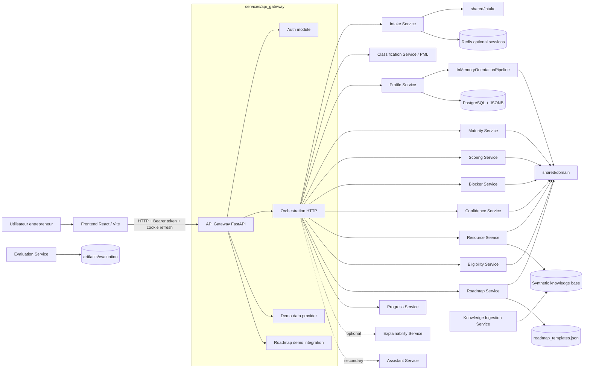

## 2. Vue packages / responsabilites

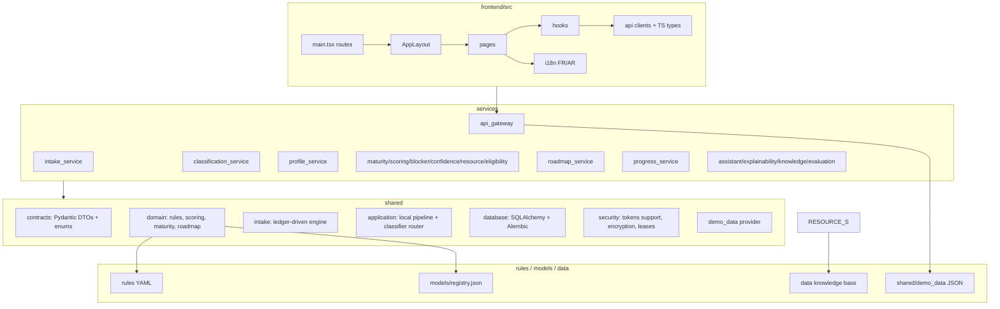

## 3. Flux principal d'analyse

Endpoint public principal: `POST /api/v1/projects/{project_id}/analysis/run`.

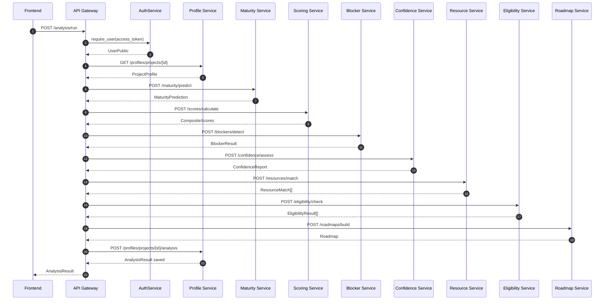

## 4. Flux intake adaptatif + PML

Le projet contient deux intakes:

- legacy: `AdaptiveIntakeEngine` dans `shared/domain/intake.py`
- adaptatif principal: `IntakeEngine` dans `shared/intake/engine.py`

Le PML vient du `classification_service`; il alimente seulement le cote
`declared_stage` / perception. Il ne modifie pas le ledger de preuves.

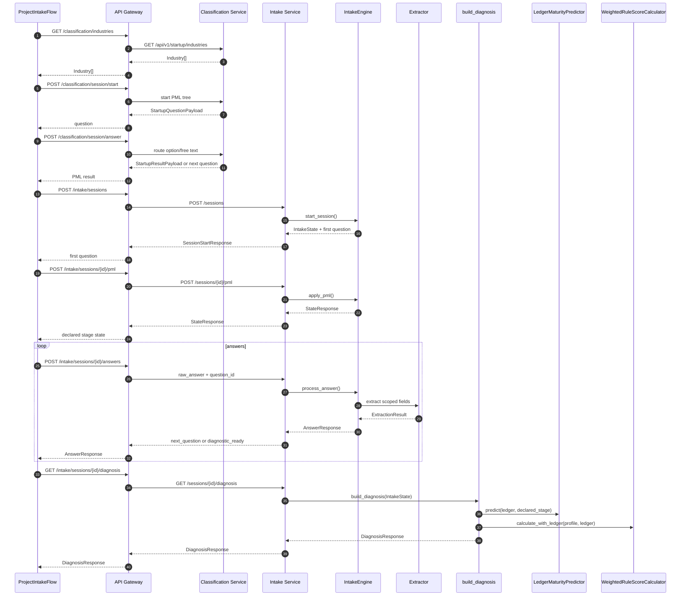

## 5. Diagramme de classes principal: contrats metier

Source: `shared/contracts/schemas.py` et `shared/contracts/enums.py`.

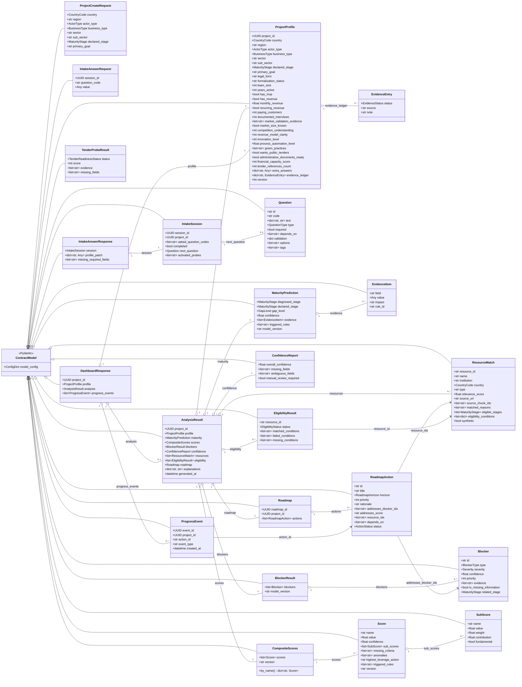

## 6. Enums metier essentiels

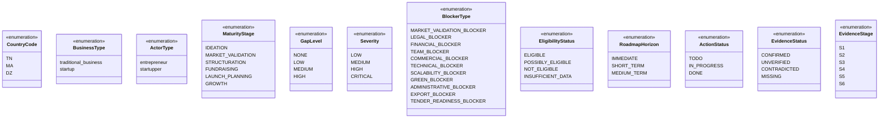

## 7. Diagramme de classes: services domaine et orchestration locale

Source: `shared/domain/*`, `shared/model_interfaces/base.py`,
`shared/application/orientation_pipeline.py`.

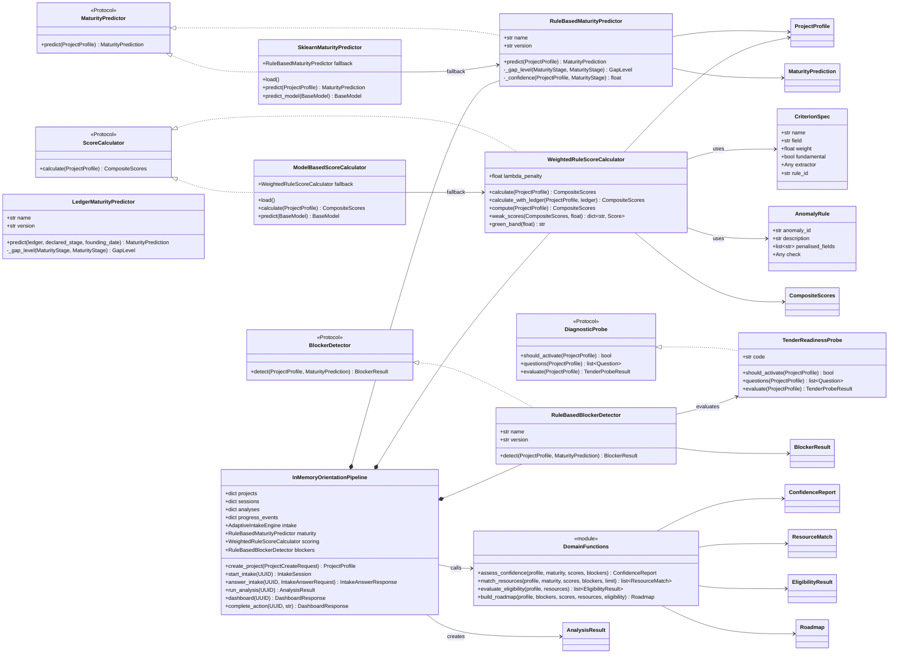

## 8. Diagramme de classes: intake adaptatif

Source: `shared/intake/contracts.py`, `shared/intake/engine.py`,
`shared/intake/session_manager.py`, `shared/intake/profile_writer.py`,
`shared/intake/extractor.py`.

```mermaid
classDiagram
direction LR

class IntakeModel {
  <<Pydantic>>
  +ConfigDict model_config
}

class Condition {
  +str field
  +ConditionOp op
  +Any value
  +str on
}

class FieldSpec {
  +str name
  +str type
  +dict~str, str~ description
  +list~str~ options
}

class IntakeQuestion {
  +str id
  +IntakePhase phase
  +dict~str, str~ text
  +list~str~ targets
  +list~FieldSpec~ extract_fields
  +list~Condition~ preconditions
  +bool is_probe
  +bool captures_declared_stage
  +render(str) Question
}

class ProbeRule {
  +str id
  +ProbeKind kind
  +list~Condition~ trigger
  +str ask
  +list~str~ inject
  +list~str~ mark_inferred
  +list~str~ confirm_fields
  +bool fire_once
}

class ContradictionRule {
  +str id
  +list~Condition~ when
  +str contradicted_field
  +str clarification_probe
  +dict~str, str~ reason
}

class LedgerEntry {
  +str field
  +Any value
  +EvidenceStatus status
  +str source_answer_id
  +str note
  +datetime updated_at
  +confidence float
}

class AnswerRecord {
  +str answer_id
  +str question_id
  +str raw_answer
  +datetime created_at
}

class MissingItem {
  +str field
  +MissingKind kind
  +float value
  +bool gates_next_stage
  +str reason
}

class IntakeState {
  +UUID session_id
  +UUID project_id
  +str lang
  +IntakePhase phase
  +dict~str, Any~ profile
  +dict~str, LedgerEntry~ ledger
  +str declared_stage
  +str declared_stage_source
  +list~dict~ pml_transcript
  +list~str~ asked_question_ids
  +list~str~ pending_probes
  +list~str~ fired_probes
  +list~dict~ contradictions
  +list~AnswerRecord~ answers
  +str current_question_id
  +bool completed
}

class ExtractionResult {
  +dict~str, Any~ extracted
  +dict~str, EvidenceStatus~ evidence_status
  +dict~str, Any~ unprompted_signals
  +bool degraded
}

class SessionStartResponse {
  +UUID session_id
  +Question first_question
}

class AnswerResponse {
  +Question next_question
  +bool diagnostic_ready
  +list~str~ fired_probes
  +list~dict~ contradictions
}

class DiagnosisResponse {
  +UUID session_id
  +bool completed
  +EvidenceStage frontier_stage
  +str declared_stage
  +MaturityPrediction diagnosis
  +CompositeScores scores
  +dict~str, LedgerEntry~ ledger
}

class StateResponse {
  +IntakePhase phase
  +EvidenceStage frontier_stage
  +EvidenceStage next_stage
  +int gates_satisfied
  +int gates_total
  +float percent_to_next
  +str declared_stage
  +bool completed
}

class SessionStore {
  <<Protocol>>
  +get(UUID) IntakeState
  +save(IntakeState)
  +delete(UUID)
}

class InMemorySessionStore {
  +dict states
  +get(UUID) IntakeState
  +save(IntakeState)
  +delete(UUID)
}

class RedisSessionStore {
  +str url
  +int ttl_seconds
  +get(UUID) IntakeState
  +save(IntakeState)
  +delete(UUID)
}

class ProfileWriter {
  <<Protocol>>
  +persist(IntakeState, AnswerRecord)
}

class InMemoryProfileWriter {
  +list writes
  +persist(IntakeState, AnswerRecord)
}

class PostgresProfileWriter {
  +Any session_factory
  +persist(IntakeState, AnswerRecord)
}

class ExtractionLLM {
  <<Protocol>>
  +complete(prompt) str
}

class Extractor {
  +ExtractionLLM provider
  +int max_attempts
  +extract(IntakeQuestion, raw_answer, lang) ExtractionResult
}

class IntakeEngine {
  +Extractor extractor
  +SessionStore session_store
  +ProfileWriter profile_writer
  +start_session(UUID, str) IntakeState
  +get_state(UUID) IntakeState
  +resume(UUID) IntakeState
  +apply_pml(UUID, payload) IntakeState
  +process_answer(UUID, raw_answer, question_id) IntakeState
  -_write(IntakeState, AnswerRecord, ExtractionResult)
  -_advance(IntakeState)
}

IntakeModel <|-- Condition
IntakeModel <|-- FieldSpec
IntakeModel <|-- IntakeQuestion
IntakeModel <|-- ProbeRule
IntakeModel <|-- ContradictionRule
IntakeModel <|-- LedgerEntry
IntakeModel <|-- AnswerRecord
IntakeModel <|-- MissingItem
IntakeModel <|-- IntakeState
IntakeModel <|-- ExtractionResult
IntakeModel <|-- SessionStartResponse
IntakeModel <|-- AnswerResponse
IntakeModel <|-- DiagnosisResponse
IntakeModel <|-- StateResponse

IntakeQuestion "1" o-- "0..*" FieldSpec : extract_fields
IntakeQuestion "1" o-- "0..*" Condition : preconditions
ProbeRule "1" o-- "0..*" Condition : trigger
ContradictionRule "1" o-- "0..*" Condition : when
IntakeState "1" o-- "0..*" LedgerEntry : ledger
IntakeState "1" o-- "0..*" AnswerRecord : answers
DiagnosisResponse "1" o-- "1" MaturityPrediction : diagnosis
DiagnosisResponse "1" o-- "1" CompositeScores : scores
DiagnosisResponse "1" o-- "0..*" LedgerEntry : ledger

SessionStore <|.. InMemorySessionStore
SessionStore <|.. RedisSessionStore
ProfileWriter <|.. InMemoryProfileWriter
ProfileWriter <|.. PostgresProfileWriter
ExtractionLLM <|.. Extractor
IntakeEngine *-- Extractor
IntakeEngine o-- SessionStore
IntakeEngine o-- ProfileWriter
IntakeEngine --> IntakeState
IntakeEngine --> ExtractionResult
IntakeEngine --> MissingItem : compute_missing
```

## 9. Diagramme de classes: classification / PML

Source: `shared/application/startup_classifier.py`,
`shared/application/router.py`,
`services/classification_service/app/api/startup_classifier.py`.

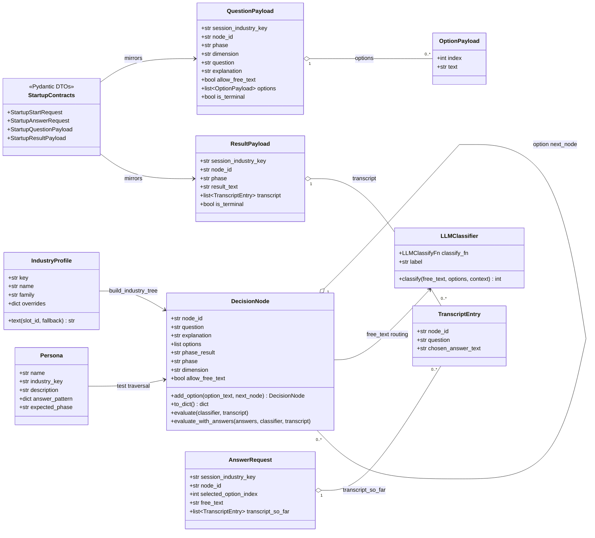

## 10. Diagramme de classes: roadmap generee

Source: `services/roadmap_service/app/schemas.py`,
`services/roadmap_service/app/generator.py`,
`services/roadmap_service/app/repository.py`.

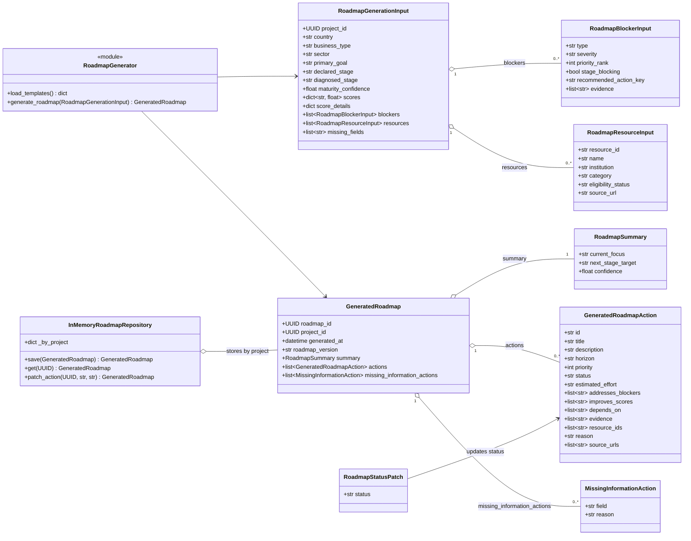

## 11. Diagramme de classes: intelligence scoring avancee

Source: `shared/domain/scoring_intelligence.py`. Cette couche est plus riche
que le `AnalysisResult` MVP. Elle sert a decomposer les scores, simuler des
contre-factuels, recommander des actions et produire des explications.

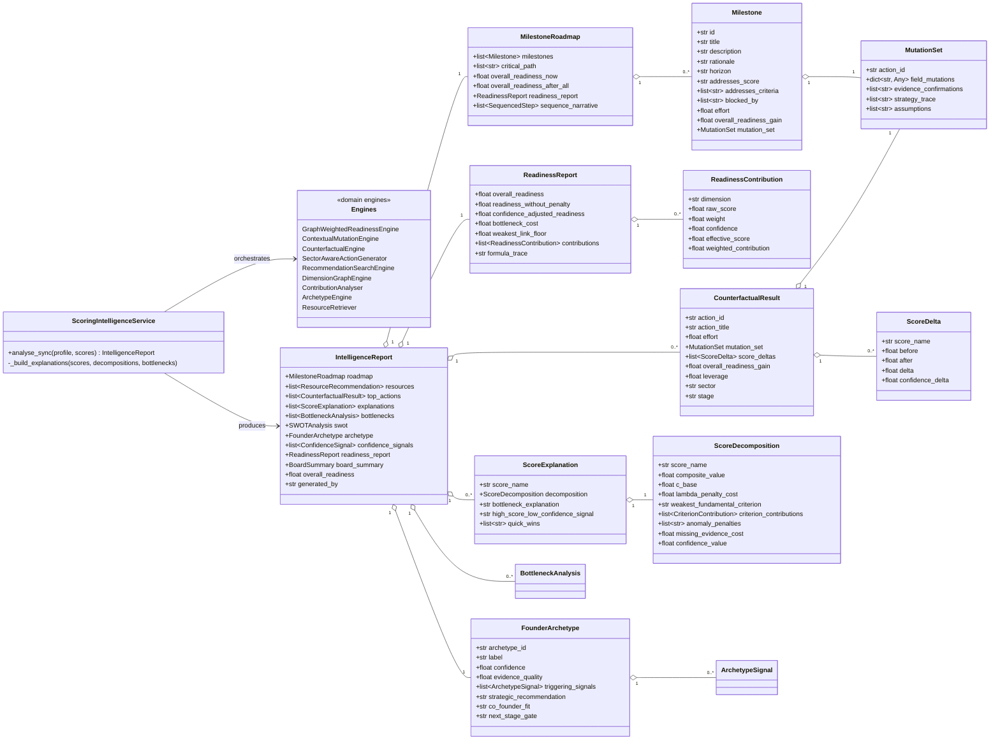

## 12. Diagramme de classes: securite et auth MVP

Source: `services/api_gateway/app/auth/*`, `shared/security/*`.

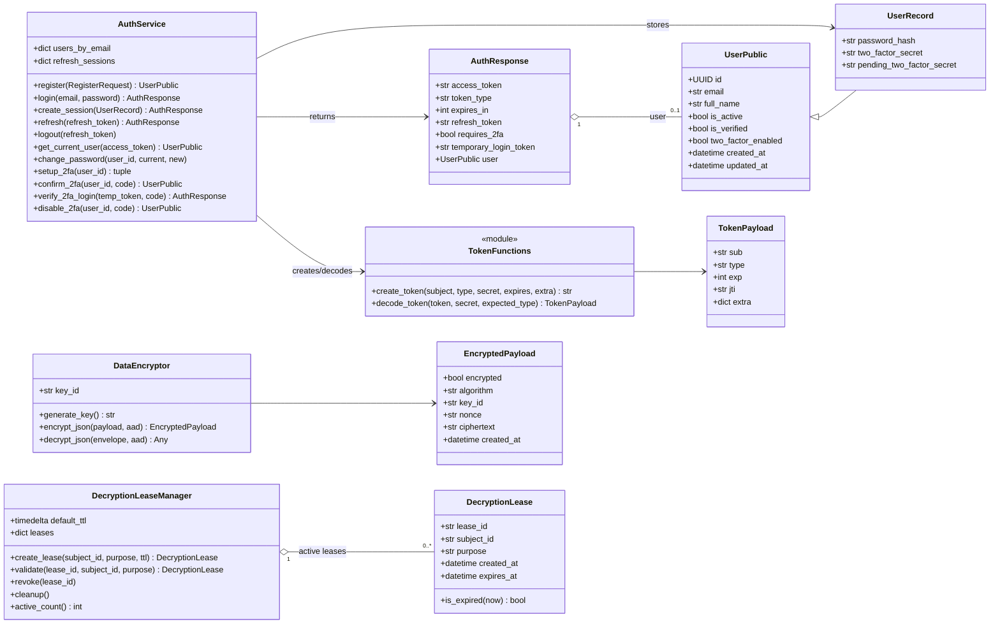

## 13. Diagramme ER: base de donnees et migration initiale

`shared/database/models.py` mappe actuellement les tables principales
(`users`, `projects`, `project_profile_versions`, `audit_events`, `resources`,
`resource_chunks`, `evaluation_runs`). La migration `0001_initial.py` cree aussi
plusieurs tables JSONB par domaine avec la meme forme: `id`, `project_id`,
`payload`, `created_at`, `updated_at`, `version`.

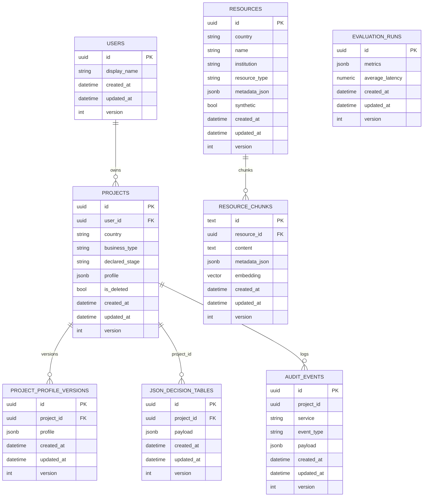

Tables regroupees dans `JSON_DECISION_TABLES`:

- `intake_sessions`
- `questions`
- `answers`
- `diagnoses`
- `maturity_predictions`
- `score_runs`
- `score_components`
- `blockers`
- `eligibility_results`
- `roadmaps`
- `roadmap_actions`
- `progress_events`
- `model_versions`
- `rule_versions`
- `evaluation_runs`

## 14. Frontend: routes, pages, hooks et clients API

Source: `frontend/src/main.tsx`, `frontend/src/api/*`, `frontend/src/hooks/*`.

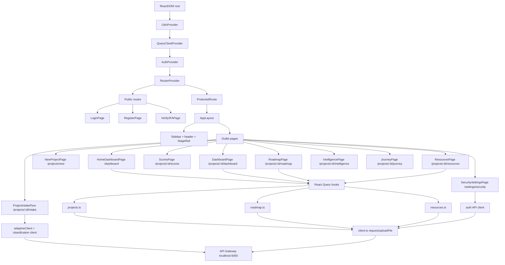

## 15. Services et endpoints internes

```mermaid
flowchart TB
    GW[API Gateway :5050]

    GW -->|/intake/start / /intake/answer| INTAKE_LEG[Intake Service legacy :5051]
    GW -->|/api/v1/intake/sessions/*| INTAKE_ADAPT[Intake Service adaptive :5051]
    GW -->|/api/v1/classification/*| CLASSIF[Classification Service :5061]
    GW -->|/profiles/projects/*| PROFILE[Profile Service :5052]
    GW -->|/maturity/predict| MATURITY[Maturity Service :5053]
    GW -->|/scores/calculate| SCORING[Scoring Service :5054]
    GW -->|/blockers/detect| BLOCKER[Blocker Service :5055]
    GW -->|/confidence/assess| CONF[Confidence Service :5056]
    GW -->|/resources/match| RESOURCE[Resource Service :5057]
    GW -->|/eligibility/check| ELIG[Eligibility Service :5058]
    GW -->|/roadmaps/build + /api/v1/projects/:id/roadmap| ROADMAP[Roadmap Service :5059]
    GW -->|/progress/actions/:id/complete| PROGRESS[Progress Service :5060]
    GW -.->|/assistant| ASSIST[Assistant Service :5064]
    GW -.->|/explain| EXPLAIN[Explainability Service :5061 in docs]
    INGEST[Knowledge Ingestion Service :5062] --> RESOURCE
    EVAL[Evaluation Service :5063] --> ART[Evaluation artifacts]
```

## 16. Lecture rapide des responsabilites

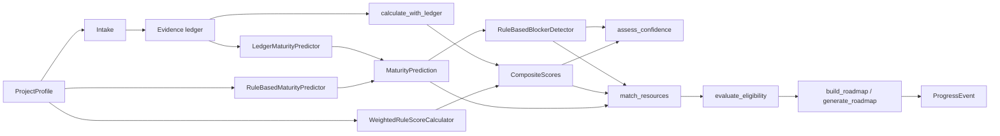

## 17. Notes de conception

- Le gateway est le point d'entree public: auth, CORS, tokens, routes protegees
  et orchestration.
- Les contrats metier sont centralises dans `shared/contracts`; les services
  retournent principalement ces DTOs.
- Les decisions MVP restent deterministes: regles YAML, calculateurs Python,
  matching lexical local et donnees synthetiques.
- Le LLM n'est pas responsable des decisions: il sert a classifier du texte
  libre dans le PML ou a produire de futures explications narratives.
- Le `InMemoryOrientationPipeline` sert aux tests, demos et services encore
  legerement persistants; PostgreSQL/Alembic sont prets pour remplacer cette
  couche progressivement.
- Le nouveau moteur d'intake est evidence-ledger-driven: il collecte des
  preuves, signale les contradictions et laisse le diagnostic a
  `LedgerMaturityPredictor` + `WeightedRuleScoreCalculator`.
