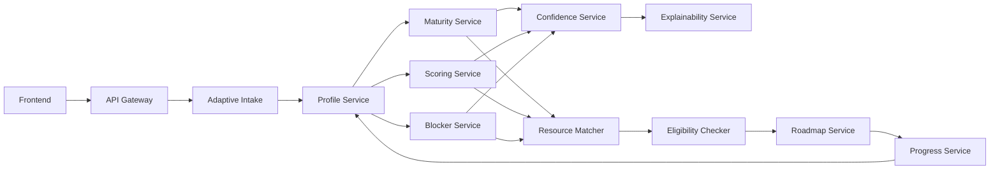

# Architecture

The MVP is a service-oriented monorepo. Each service exposes `/health` and `/ready`, owns a narrow responsibility and shares Pydantic contracts from `shared/contracts`.

Communication is HTTP in Docker Compose. Tests and scripts use a local orchestrator mode backed by the same domain services, which keeps the demo deterministic.

Future migration points are explicit: HTTP orchestration can be replaced by a broker, in-memory repositories by SQLAlchemy repositories, and rule-based predictors by versioned model providers.
